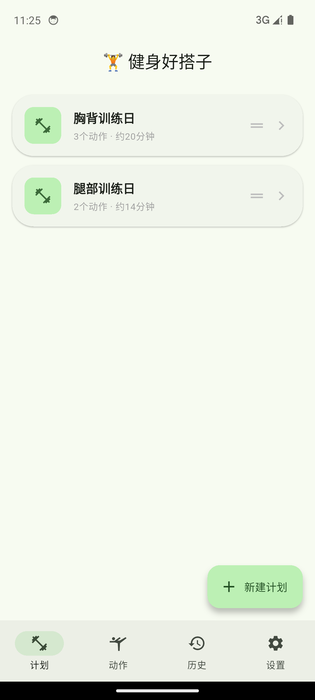
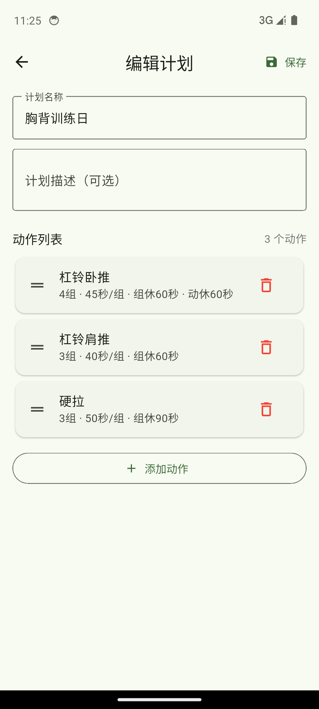
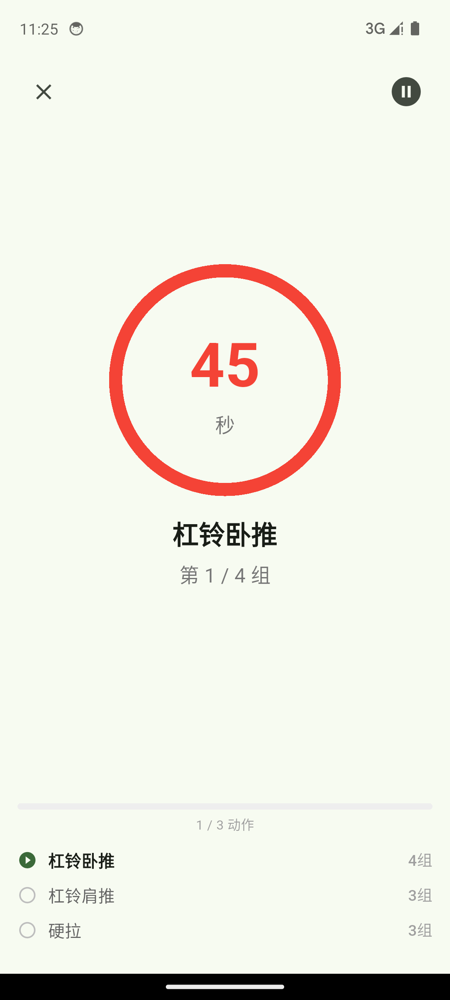
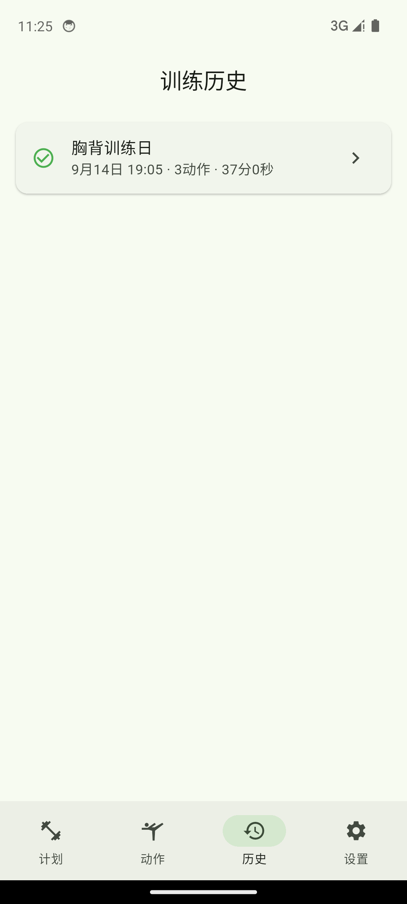
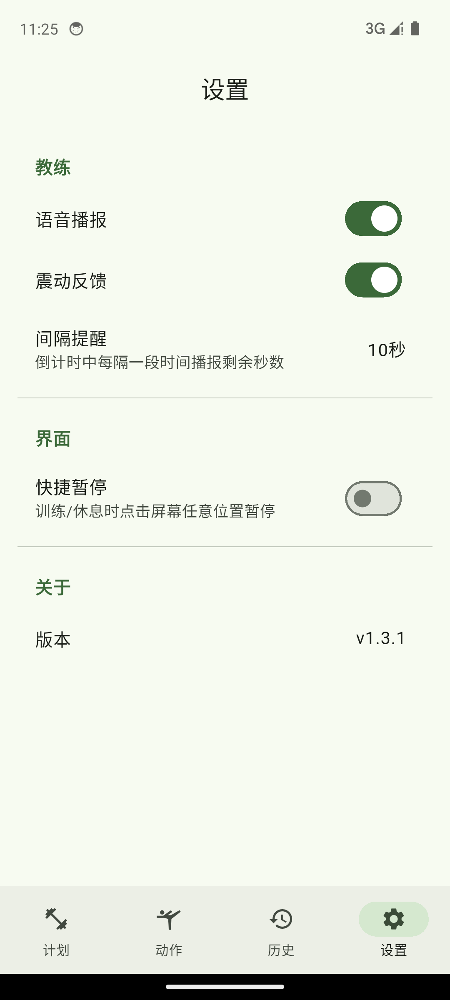

# 健身好搭子

一个健身动作编排与跟练的 Android / iOS App。

自己编排动作、组数与时长，训练时有个声音在耳边报动作、喊倒计时——面向有一定健身基础、知道自己该练什么、会自己编排动作的使用者。

**100% 离线 · 无账号 · 无后端 · 无广告**

## 界面

<p align="center">
  
  
  
</p>
<p align="center">
  
  
  
</p>

> 从左到右、从上到下：计划列表 / 计划编排 / 训练中倒计时 / 训练完成 / 训练历史 / 设置。
> 截图取自 Android 模拟器上运行的真实界面。

## 功能

### 编排训练计划

- 拖拽调整动作顺序，每个动作可单独设置：组数、次数、每组时长、组间休息、动后休息
- 预置基础动作（杠铃卧推 / 深蹲 / 硬拉 / 哑铃弯举 / 肩推 / 卷腹 / 开合跳），按肌群分组
- 支持自定义动作，覆盖任何训练需求
- 计划卡片显示动作数与预估时长

### 语音教练

- 训练中语音播报即将进行的动作名称与倒计时（"3、2、1、开始"）
- 可设间隔提醒：倒计时中每隔 N 秒播报剩余秒数
- 训练完成自动播报总结
- 支持静音（仅视觉提示）

### 训练视图

- 倒计时圆环，红 / 橙 / 绿三色区分「工作 / 组间休息 / 动后休息」
- 支持暂停、跳过休息；可开启「快捷暂停」（点击屏幕任意位置暂停）
- 后台运行：息屏后继续计时与语音播报

### 训练记录

- 自动保存每次训练：计划名称、总时长、各动作完成情况
- 绿色勾 = 全部完成，橙色 = 有未完成组
- 支持删除记录

## 隐私设计

- **100% 离线**：不申请 `INTERNET` 权限，程序物理上无法联网
- 无账号、无登录、无后端、无广告、无第三方统计 SDK
- 训练计划与记录只保存在本机数据库，卸载即删
- 申请的系统权限仅围绕「训练中后台保持计时与语音播报」这一本地功能：
  `FOREGROUND_SERVICE` / `FOREGROUND_SERVICE_SPECIAL_USE` / `WAKE_LOCK` / `POST_NOTIFICATIONS` / `VIBRATE`

## 平台与依赖

- Flutter 3.47.2，Dart SDK `^3.12.2`；Android（`targetSdk 36`）与 iOS
- 运行时依赖：`provider`、`sqflite`、`path`、`flutter_tts`、`flutter_local_notifications`、
  `timezone`、`intl`、`uuid`、`package_info_plus`、`cupertino_icons`

## 开发

命令都在仓库根目录执行。

```bash
flutter pub get
flutter run
flutter analyze
flutter test
flutter build apk --release
flutter build ios --simulator
```

## 代码结构

```
lib/
├── pages/        各页面：计划列表、计划编排、动作库、训练、总结、历史、设置
├── providers/    PlanProvider / WorkoutProvider / SettingsProvider —— 应用状态
├── services/     CoachEngine（训练状态机）、TTS、震动、通知、后台保活
├── database/     sqflite DAO 与 DatabaseHelper
├── widgets/      倒计时圆环、计划卡片等
├── models/       计划、动作、训练记录等数据模型
└── utils/        提示音等工具
```

`CoachEngine` 是核心状态机（`lib/services/coach_engine.dart`），驱动
`IDLE → WORKING → RESTING → … → COMPLETED` 的整个训练流程；计时基于
`DateTime.now()` 与基准时间的差值（而非 `Timer` tick），以在息屏 / 后台挂起后仍保持准确。

## 测试

`test/` 下按被测对象分文件（模型 / 数据库 / 服务）：

```bash
flutter test
```

应用商店截图由 `integration_test/android_screenshots_test.dart` 用 widget tester 驱动界面生成，
需指定设备运行（每屏打印 `@@SHOT` 标记，由外部脚本抓图）：

```bash
flutter test integration_test/android_screenshots_test.dart -d <device-id>
```

## 文档

| 文档 | 内容 |
|---|---|
| `docs/superpowers/specs/fitness-coach-design.md` | 设计文档 |
| `docs/privacy-policy.html` | 隐私政策（经 GitHub Pages 发布） |
| `CLAUDE.md` | 面向 AI Agent 的仓库约定 |

> 应用商店上架材料（市场文案、上架操作手册）保留在本地 `docs/huawei/`，不纳入版本控制。
